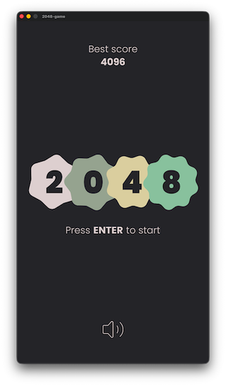
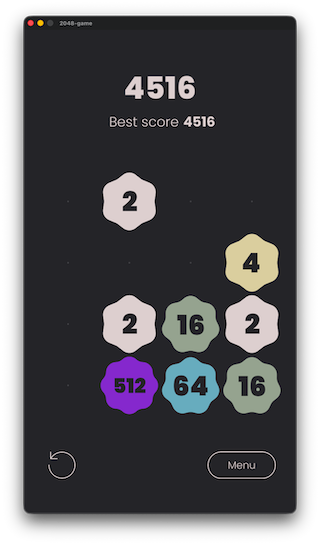

# 2048 Remake

This is a personal study project where I rebuilt the classic **2048** game using **C++** with [**Cocos2d-x**](https://www.cocos.com/en/cocos2d-x) 
framework and ported to [**Axmol**](https://axmol.dev/).

Play in the browser on [itch.io](https://raydtutto.itch.io/2048). Enjoy!

 